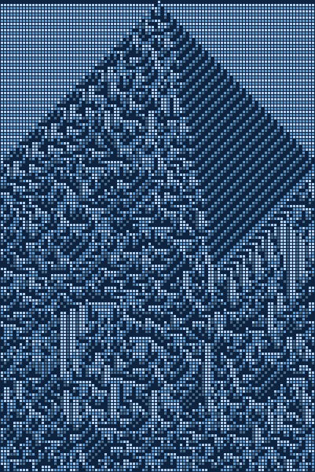
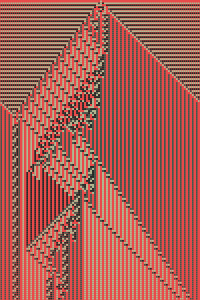
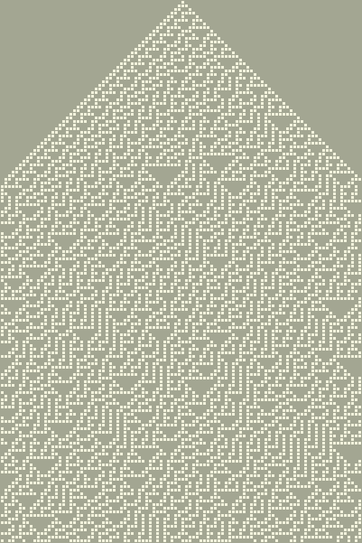
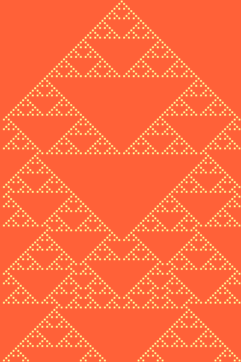
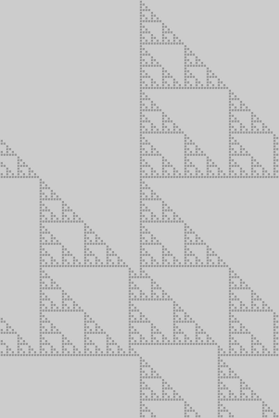

# Cellular Automata

## Getting Started

### Get color themes data

```
curl -o themes.bin https://storage.googleapis.com/fs.kellegous.com/themes-small.bin
```

## 4-color elementary cellular automata

### Render CA with randomly generated rule and theme.
```
cargo run --release -- 4
```


### Render CA with specified rule and theme.
```
cargo run --release -- 4 --rule=16015190877491773079 --theme=themes.bin:44804
```


## 1-color elementary cellular automata

### Render CA with randomly generated rule and theme.
```
cargo run --release -- 1
```



### Render CA with specified rule and theme.
```
cargo run --release -- 1 --rule=90 --theme=themes.bin:12
```



### Render CA with specified output file.
```
cargo run --release -- 1 --rule=60 --dest=60.png
```



## Author
Kelly Norton<br>
kellegous@gmail.com
